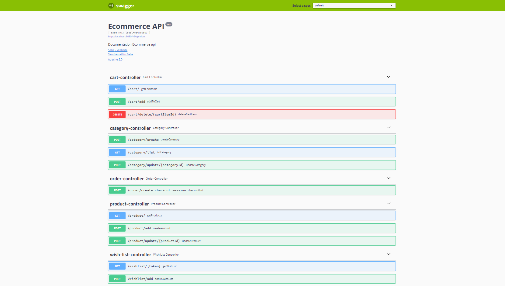

# API E-commerce

## Description
Cette API permet de gérer un site e-commerce, y compris la gestion des utilisateurs, des produits, des catégories, des paniers et des listes de souhaits. Elle intègre Stripe pour les paiements.



## Installation

### Prérequis
- Java 11 ou supérieur
- MySQL

### Configuration de la base de données
Assurez-vous que MySQL est installé et une base de données appelée `ecommercev2` est créée. Ajoutez les configurations suivantes à votre fichier `application.properties` :

```properties
spring.datasource.url=jdbc:mysql://localhost:3306/ecommercev2
spring.datasource.username=root
spring.datasource.password=root
spring.datasource.driver-class-name=com.mysql.cj.jdbc.Driver
spring.jpa.hibernate.ddl-auto=update
spring.mvc.pathmatch.matching-strategy=ANT_PATH_MATCHER


BASE_URL=http://localhost:8081/
```

### Installation des dépendances
Clonez le dépôt et installez les dépendances avec Maven :

```bash
git clone https://github.com/IronNetta/API-Ecommerce.git
cd API-Ecommerce
mvn install
```

## Utilisation
Lancez l'application avec :

```bash
mvn spring-boot:run
```

L'API sera accessible à l'URL : `http://localhost:8081/`.


## Endpoints

### Utilisateur
- `POST /user/signup`: Inscription d'un nouvel utilisateur.
- `POST /user/signin`: Connexion d'un utilisateur.

### Produit
- `POST /product/add`: Ajouter un produit.
- `GET /product/`: Lister tous les produits.
- `POST /product/update/{productId}`: Mettre à jour un produit.

### Catégorie
- `POST /category/create`: Créer une catégorie.
- `GET /category/list`: Lister les catégories.

### Panier
- `POST /cart/add`: Ajouter au panier.
- `GET /cart/`: Récupérer les articles du panier.
- `DELETE /cart/delete/{cartItemId}`: Supprimer un article du panier.

### Liste de souhaits
- `POST /wishlist/add`: Ajouter un produit à la liste de souhaits.
- `GET /wishlist/{token}`: Récupérer la liste de souhaits d'un utilisateur.

### Commande
- `POST /order/create-checkout-session`: Créer une session de paiement avec Stripe.

## Technologies Utilisées
- Spring Boot
- MySQL
- Stripe
- Swagger (pour la documentation API)

## Contributions
Les contributions sont les bienvenues ! Veuillez soumettre une demande de tirage avec vos modifications.

## Licence

Ce projet est sous licence MIT. Voir le fichier [LICENSE](LICENSE) pour plus de détails.
